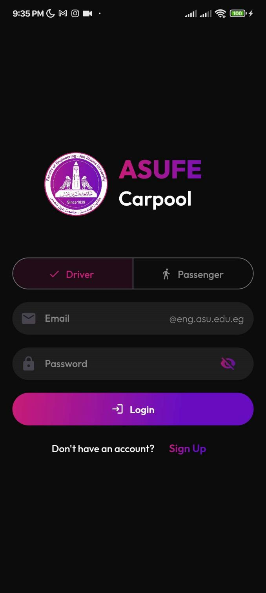
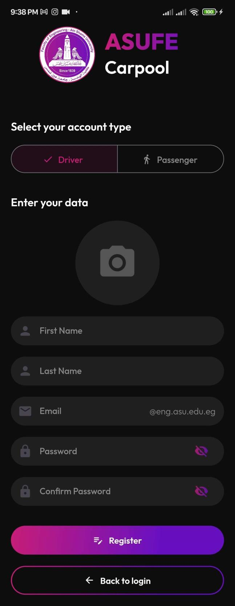
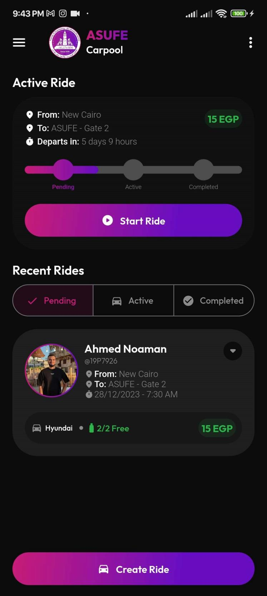
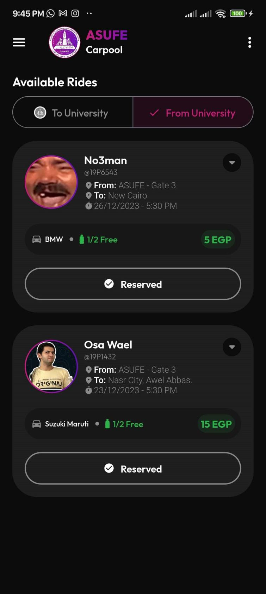
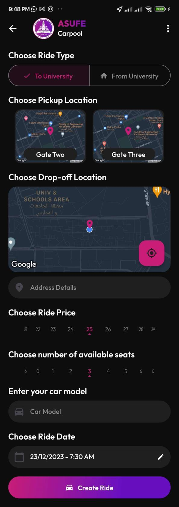
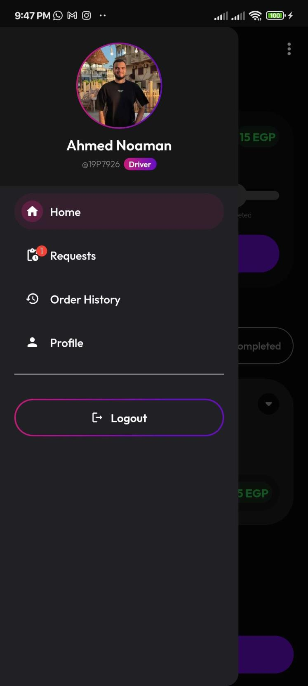
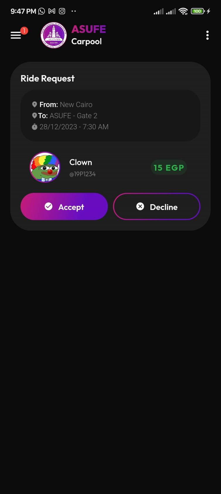
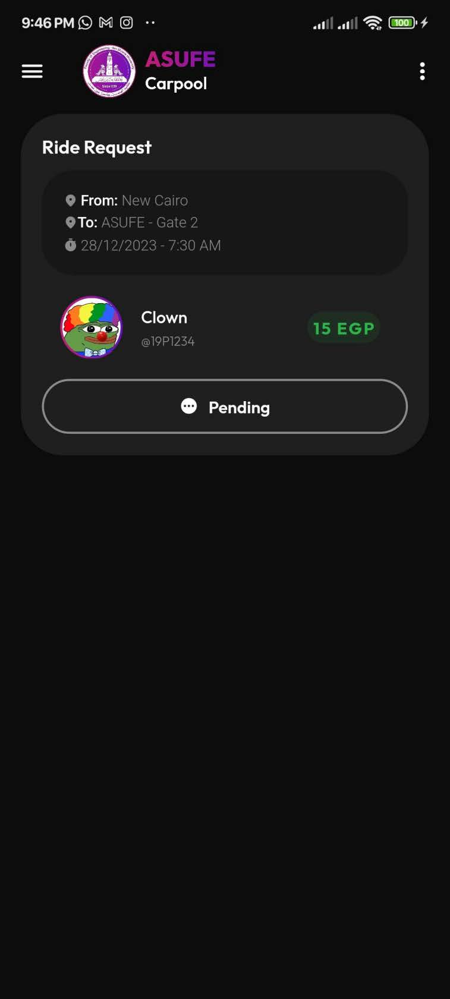
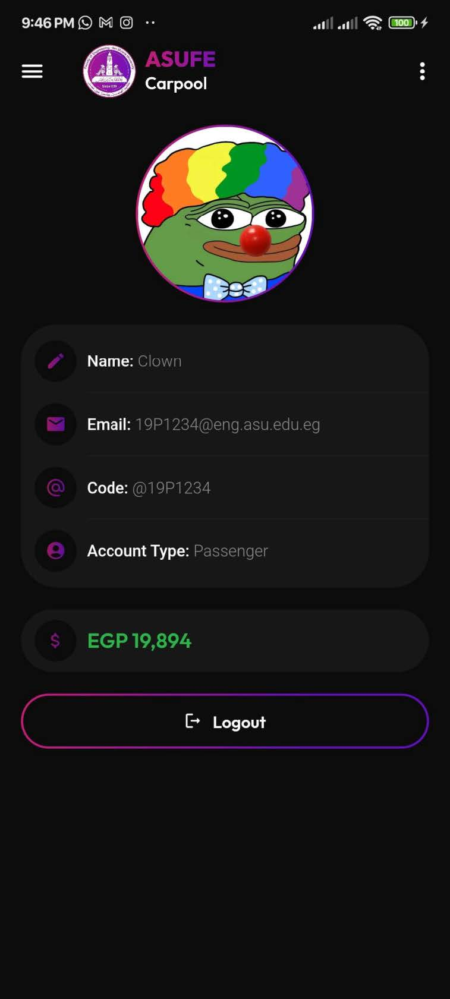

# Project Title: ASUFE - Carpool

Brief project description 2-3 sentences.
This project is a carpooling application that allows students to share rides to and from the faculty. The application allows students to create a profile, post rides, and search for rides.

## Table of Contents
- [Installing](#installing)
- [App Screenshots](#usage)
- [Info](#info)

## Installing
1. Clone the repository
2. Run `flutter pub get` to install dependencies
3. Run `flutter run` to start the application

```bash
git clone
flutter pub get
flutter run
```

## App Screenshots
<table>
  <tr>
    <td></td>
    <td></td>
    <td></td>
  </tr>
  <tr>
    <td></td>
    <td></td>
    <td></td>
  </tr>
  <tr>
    <td></td>
    <td></td>
    <td></td>
  </tr>
</table>

## Info
This app was created as a final project for my Mobile Programming course at ASU Faculty of Engineering. The app was created using Flutter and Firebase.